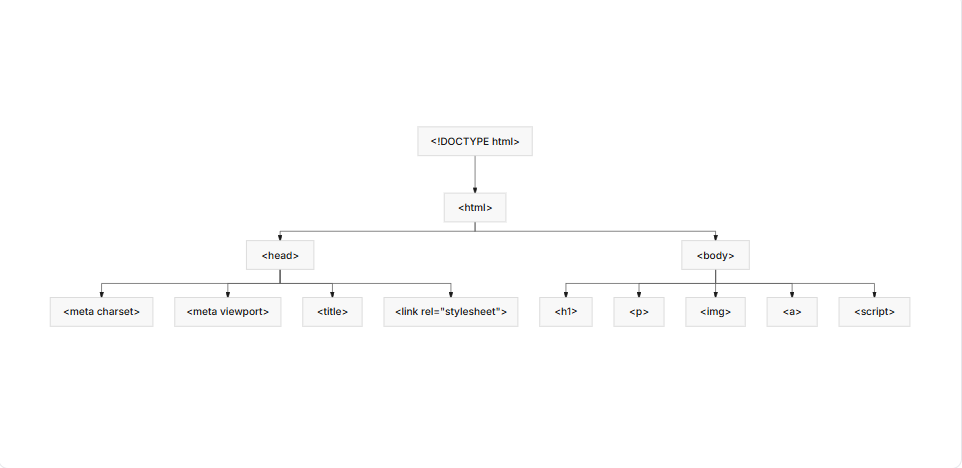

# Understanding HTML Document Structure and Basic Tags

*HTML is the foundational language of the web, the structure upon which everything else is built. When your browser loads a webpage, it's primarily reading an HTML document to understand what content to display and how it's organized. This isn't just a collection of text; it's a carefully structured document that tells the browser how to render text, images, videos, and interactive elements.*
The Essential Document Type Declaration

> Every HTML document starts with a Document Type Declaration, or 
DOCTYPE. This isn't an HTML tag itself, but rather an instruction to the web browser about which version of HTML the page is written in. For modern web development, we use HTML5, and its DOCTYPE is remarkably simple:
```html

<!DOCTYPE html>
```
This declaration must be the very first thing in your HTML file, before any other tags. It ensures that browsers render your page in "standards mode," which means they follow modern web standards rather than attempting to emulate older, often inconsistent, rendering behaviors. Without it, browsers might switch to "quirks mode," leading to unexpected layout and styling issues. Always include it.

> ## The Root Element: <html>
Immediately after the <!DOCTYPE html> declaration comes the <html> tag. This is the root element of every HTML page. All other content for your webpage, everything you see and much of what the browser uses internally, lives inside this tag. Think of it as the container for your entire document.

It's common practice to include a lang attribute on the <html> tag. This attribute declares the primary language of the document, which is important for accessibility tools (like screen readers) and search engines. For English content, you'd use lang="en".

```html

<!DOCTYPE html>
<html lang="en">
  <!-- All other HTML content goes here -->
</html>
```
## The Document Head: <head>
Inside the <html> element, the first major section you'll find is the <head>. This section contains metadata about the HTML document itself. Metadata is data about data—information that isn't directly displayed on the page as content but provides crucial instructions and details to the browser, search engines, and other web services.

>  ### Things you'll commonly find in the <head> include:

```html
<meta> 
tags: These provide various types of metadata. A critical one is meta charset="UTF-8", which defines the character encoding for the document. UTF-8 supports almost all characters and symbols in the world, ensuring text displays correctly across different languages and platforms. Another common one is meta name="viewport" content="width=device-width, initial-scale=1.0", which is vital for responsive design, instructing browsers how to control the page's dimensions and scaling on different devices.

<title> tag: This defines the title of the document, which appears in the browser tab, window title bar, or as the default name when bookmarking a page. It's a key factor for user experience and search engine optimization (SEO).

<link> tags: These are used to link external resources to your HTML document. The most common use is linking to external CSS stylesheets, for example: <link rel="stylesheet" href="styles.css">.

<script> tags: While JavaScript typically goes just before the closing </body> tag for performance reasons, sometimes you'll see <script> tags in the <head>, particularly if the script needs to run before the page content loads or if it's linking an external script.
Here's an example of a typical <head> section:
```

```html

<!DOCTYPE html>
<html lang="en">
<head>
    <meta charset="UTF-8">
    <meta name="viewport" content="width=device-width, initial-scale=1.0">
    <title>My Awesome Website</title>
    <link rel="stylesheet" href="styles.css">
    <script src="my-script.js"></script>
</head>
<body>
    <!-- Page content will go here -->
</body>
</html>
```
The browser processes the <head> content before rendering the <body>. This ensures that important settings, styles, and scripts are loaded and applied before the user sees the page content, preventing flashes of unstyled content or rendering issues.

The Document Body: <body>
The <body> element contains all the visible content of your web page. Everything the user sees and interacts with—text, images, links, forms, buttons, videos, and more—is placed within the <body> tags. This is where you structure the actual content that delivers your message or functionality.

```html

<!DOCTYPE html>
<html lang="en">
<head>
    <meta charset="UTF-8">
    <meta name="viewport" content="width=device-width, initial-scale=1.0">
    <title>My Awesome Website</title>
    <link rel="stylesheet" href="styles.css">
</head>
<body>
    <h1>Welcome to My Website!</h1>
    <p>This is a paragraph of content.</p>
    
    <a href="about.html">Learn more about us</a>
    <script src="my-script.js"></script>
</body>
</html>
```

```html 
While most <script> tags that directly manipulate the page content are placed at the very end of the <body> (just before the closing </body> tag), this is not a strict rule but a best practice for performance. Placing scripts at the end allows the browser to render the HTML content first, so users see something on the screen quicker, even if the JavaScript hasn't fully loaded or executed yet.


``` 
# Anatomy of an HTML Document
```html 
Let's visualize the hierarchical structure of a basic HTML document. It's like a tree, with the <html> element as the root, branching into the <head> and <body>.
```



<!-- ```html
<!DOCTYPE html>
<html>
<head>
<body>
<meta charset>
<meta viewport>
<title>
<link rel="stylesheet">
<h1>
<p>

<a>
<script>
```
-->

```html 
This diagram illustrates the mandatory parts of an HTML document, showing how the DOCTYPE declaration comes first, followed by the <html> root element, which then contains both the <head> (for metadata) and <body> (for visible content).

```

### Basic HTML Tags

```html
HTML uses "tags" to mark up elements. Tags are keywords enclosed in angle brackets, like <p>. Most HTML tags come in pairs: an opening tag and a closing tag. The content goes between them. The closing tag includes a forward slash before the tag name, like </p>.
```
## Headings: ```<h1> to <h6>```
> Headings are used to define the structure and hierarchy of your content. They range from ```<h1>``` (the most important heading, usually the main title of the page) down to ```<h6>``` (the least important subheading). Use them semantically to outline your content, not just to make text bigger or bolder.

```html

<h1>Main Page Title</h1>
<p>This is some introductory text.</p>
<h2>Section Title</h2>
<p>Content for the first section.</p>
<h3>Subsection Title</h3>
<p>More detailed content for the subsection.</p>
<h2>Another Section Title</h2>
<p>Content for the second main section.</p>
```
> Browsers display ```<h1>``` text largest and ```<h6>``` text smallest by default, but you should choose headings based on their logical importance, not just their appearance. Styling (size, color, font) is the job of CSS, which we'll cover later.

## Paragraphs: ``<p>``
> The ``<p>`` tag defines a paragraph of text. It's the most common tag for grouping plain text content. Browsers automatically add some space (margin) above and below paragraphs to make them easy to read.

---

```html
<p>This is the first paragraph of my web page. It contains some general information about the topic at hand.</p>
<p>Here is another paragraph. It continues the discussion, providing more details and explanations for the reader.</p>
Line Breaks: <br>
The <br> tag creates a line break. Unlike paragraphs, which create blocks of text with spacing, <br> simply moves the subsequent content to the next line without adding extra vertical space. It's a self-closing tag, meaning it doesn't have a separate closing tag (</br>); you just write <br>.

Use <br> sparingly. It's typically suitable for breaking lines within a single block of content, like an address or a poem, where distinct paragraphs aren't appropriate.
```
----
```html

<p>
  My Address:<br>
  123 Web Dev Lane<br>
  HTML City, CSS State 90210
</p>
```
## Horizontal Rule: ``<hr>``
The ```<hr>``tag represents a thematic break between paragraph-level elements. Visually, it typically renders as a horizontal line across the page, though its exact appearance can be styled with CSS. It's a self-closing tag.

```html

<h1>Introduction</h1>
<p>This is the introductory content for the topic.</p>
<hr> <!-- Visual separation -->
<h2>Key Concepts</h2>
<p>Here we delve into the main ideas.</p>
```
The ``<hr>`` tag is useful for visually separating distinct sections of content when a new heading isn't necessary, but a clear break is desired.

> ## Full Example of a Basic HTML Document
Let's put it all together. Here's what a minimal, yet properly structured, HTML document looks like with some basic tags:

```html

<!DOCTYPE html>
<html lang="en">
<head>
    <meta charset="UTF-8">
    <meta name="viewport" content="width=device-width, initial-scale=1.0">
    <title>My First HTML Page</title>
</head>
<body>
    <h1>Hello, Full Stack World!</h1>
    <p>This is my very first web page, structured with basic HTML tags.</p>
    <hr>
    <h2>About This Page</h2>
    <p>
        I'm learning about HTML document structure and fundamental elements.<br>
        It's important to understand the hierarchy from the DOCTYPE to the body content.
    </p>
    <h3>What's Next?</h3>
    <p>
        Next, I'll be exploring more tags for text, links, and images to build richer web content.
    </p>
</body>
</html>
```
> **When a browser loads this file, it first reads ``<!DOCTYPE html>`` to understand it's an HTML5 document. Then, it recognizes the ``<html>``root, processes the metadata in ``<head>`` (setting the character encoding, viewport, and tab title), and finally renders the visible content defined within the `<body>`, applying default styles for headings, paragraphs, line breaks, and the horizontal rule.**

# **Summary**
> *You've now got a solid understanding of the fundamental structure of an HTML document. Every web page you build will start with the ``<!DOCTYPE html>`` declaration, the ``<html>`` root element, and then divide into the ``<head>`` for metadata and the `<body>` for visible content. You also learned how to use essential content tags like `<h1>` through `<h6>` for headings, `<p>` for paragraphs, `<br>` for line breaks, and `<hr>` for thematic breaks. This foundational knowledge is crucial because it dictates how browsers interpret and display your content, and it sets the stage for adding styles with CSS and interactivity with JavaScript.*