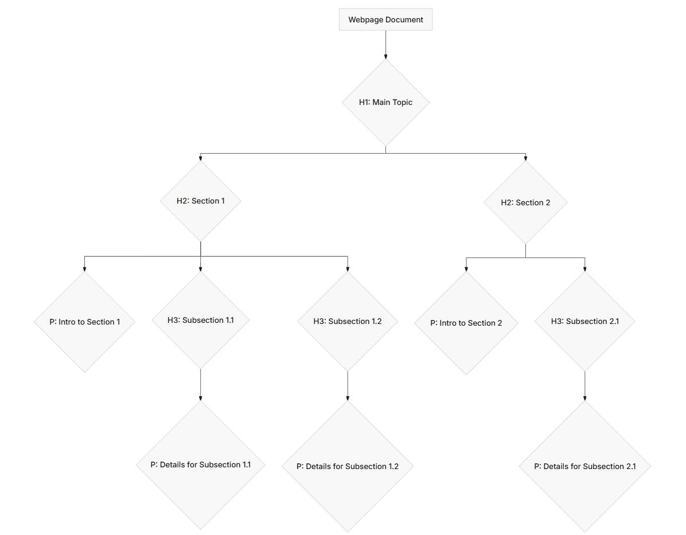

# Working with Text, Headings, and Paragraphs
> HTML isn't just about putting content on a page; it's about giving that content meaning and structure. When you think about text on a webpage, it's rarely just one continuous blob. It has titles, subtitles, individual paragraphs, quotes, and specific words or phrases that need emphasis. Mastering how to use headings and paragraphs is fundamental to creating readable, accessible, and well-organized web content.

# Headings: Structuring Your Content Hierarchy
> Headings in HTML are not just for making text bigger and bolder; they define the hierarchy and structure of your content. Think of them like an outline for a book or an essay. You have main titles, chapter titles, section titles, and so on. HTML provides six levels of headings, from ``<h1>`` (the most important) to ``<h6>`` (the least important).

```html

<!DOCTYPE html>
<html lang="en">
<head>
    <meta charset="UTF-8">
    <meta name="viewport" content="width=device-width, initial-scale=1.0">
    <title>Understanding Headings</title>
</head>
<body>
    <h1>The Grand Title of My Webpage</h1>
    <p>This is an introductory paragraph about the main topic.</p>
    <h2>A Major Section of Content</h2>
    <p>This paragraph introduces the first major section.</p>
    <h3>A Sub-Section Within the Major Section</h3>
    <p>Here we dive deeper into the sub-section's topic.</p>
    <h4>A Smaller Point Within the Sub-Section</h4>
    <p>Further details on a specific point.</p>
    <h2>Another Major Section</h2>
    <p>Starting a new major topic here.</p>
    <h3>Another Sub-Section</h3>
    <p>Content related to the second major section.</p>
</body>
</html>
```
---
> The hierarchy is critical. Search engines use headings to understand the structure and content of your page, which impacts your search ranking. Screen readers, used by visually impaired users, also rely on headings to navigate a page quickly. They can jump from heading to heading, just like you might skim a table of contents.

## Rules for Using Headings
One ``<h1>`` per page: The``<h1>`` tag should represent the main title or subject of your entire page. Think of it as the headline of a newspaper article. Using more than one ``<h1>`` can confuse search engines and assistive technologies about your page's primary focus.

## Follow the hierarchy:
 Always proceed in sequential order. Don't skip levels (e.g., go from an ``<h1>`` directly to an ``<h3>``). If you skip, you break the logical structure of your document, making it harder to understand for both machines and people using screen readers.

## Don't use for styling: 
Headings come with default browser styling (bigger font size, bold). However, you should never choose a heading level solely because of how it looks. If you want a piece of text to be large and bold but it's not a heading in the document's outline, use CSS (which we'll cover in Module 2) to style a paragraph or a ``<span>`` tag. HTML is about meaning; CSS is about presentation.

## Paragraphs: The Foundation of Text Content
Paragraphs are the most common way to display blocks of text content on a webpage. The ``<p>`` tag is used for precisely that: individual paragraphs of text. Each paragraph should contain a cohesive block of thought or information. Browsers automatically add some space above and below paragraphs, visually separating them.

--- 

```html

<!DOCTYPE html>
<html lang="en">
<head>
    <meta charset="UTF-8">
    <meta name="viewport" content="width=device-width, initial-scale=1.0">
    <title>Working with Paragraphs</title>
</head>
<body>
    <h1>Welcome to My Blog Post</h1>
    <p>
        This is the first paragraph of my blog post. It introduces the main idea
        and sets the stage for what's to come. Notice how the browser automatically
        adds a line break and some vertical space after this paragraph.
    </p>
    <p>
        Here is the second paragraph. Each paragraph tag typically represents
        a distinct thought or topic within your content. Keeping paragraphs focused
        makes your content easier to read and digest for your audience.
    </p>
    <p>
        Even if your paragraph is just a single sentence, if it stands as a
        complete thought, it should be wrapped in its own `<p>` tag. Avoid using
        `<br>` tags repeatedly to simulate paragraphs; that's not semantic.
    </p>
</body>
</html>

```
## Line Breaks vs. Paragraphs
> A common mistake for beginners is to use the ``<br>`` (break) tag multiple times to create vertical space or new lines. While ``<br>`` does create a line break, it should only be used where a forced line break is semantically appropriate within a single block of text, like in an address or a poem.

```html

<p>
    My Address:<br>
    123 Web Dev Lane<br>
    HTML City, State 90210
</p>
<p>
    Instead of using this:<br><br><br>
    For creating large gaps, which is bad practice.
</p>
```
> Using multiple ``<br>`` tags to simulate paragraph breaks or larger vertical spacing is incorrect. It creates unsemantic markup and makes it harder to control spacing with CSS later. If you need a new paragraph, use a new ``<p>`` tag. If you need more space between paragraphs, control it with CSS.

## Inline Text Formatting: Emphasizing Specific Words
> While headings and paragraphs structure blocks of text, you often need to emphasize or add specific meaning to smaller pieces of text within a paragraph or heading. HTML provides several inline tags for this purpose.

**Strong Importance ``(<strong>)`` and Emphasis ``(<em>)``**

> These two tags are perhaps the most frequently used for inline text formatting.

``<strong>``: Indicates strong importance. Text within ``<strong>`` is typically displayed as bold by browsers, but its semantic meaning is "important."
``<em>``: Indicates emphasis. Text within ``<em>`` is typically displayed as italic by browsers, but its semantic meaning is "emphasized."
The key here is semantic meaning. Don't use ``<strong>`` just because you want text bold, or ``<em>`` just because you want it italic. Use them when the text genuinely carries strong importance or needs emphasis.

> ham html mein ``<i>`` tag ka use krte hain text ko italic krne k liye.. and ``<b>`` tag ka use same as strong tag   

```html

<p>
    It is <strong>absolutely critical</strong> that you understand the difference
    between semantic HTML and presentational HTML. If you don't, your websites
    will be <em>less accessible</em> and <em>harder to maintain</em>.
</p>
```
## Other Useful Inline Tags
**``<mark>``: Highlights text, typically displayed with a yellow background. Useful for drawing attention to certain words for review or relevance.**
```html
<p>The <mark>deadline</mark> for the project is approaching rapidly.</p>
```

``<small>``: Represents side comments and small print, like copyright information or legal disclaimers.

```html

<p><small>&copy; 2023 My Awesome Website. All rights reserved.</small></p>
```
``<del>`` and ``<ins>``: Indicate text that has been deleted or inserted from a document. Useful for showing revisions. ``<del>`` often appears with a strikethrough, ``<ins>`` often underlined.

```html

<p>The old price was <del>$29.99</del>, now it's <ins>$19.99</ins>!</p>
```
``<sub>`` and ``<sup>``: Subscript and superscript text, respectively. Useful for scientific formulas or ordinal indicators.

```html
<p>The chemical formula for water is H<sub>2</sub>O.</p>
<p>This is my 1<sup>st</sup> attempt.</p>
```
# --> Semantic Usage of Text Elements
> The overarching principle for working with text in HTML is semantics. Every tag you choose should convey the meaning or purpose of the content it wraps, not just how it looks. When you use semantic HTML:

## Accessibility improves: 
>Screen readers can interpret the structure and meaning, providing a better experience for users with disabilities.

## SEO improves: 
> Search engines better understand your content, potentially improving rankings.

## Maintainability improves:
> Your code is clearer and easier for other developers (and your future self) to understand and modify.

## Styling becomes easier:
> You can target elements based on their meaning (e.g., "make all important text red") rather than arbitrary classes.

>> Here's a visual representation of how headings establish a document structure:



This diagram illustrates how H1 defines the top-level topic, H2 breaks it into major sections, and H3 further subdivides those sections, with paragraphs (P) filling in the actual content within this hierarchy.

## Exercises
**Recreate a Blog Post Structure:** Imagine you are writing a simple blog post about "The Benefits of Learning HTML." Create an HTML document with the following structure:
> One main title for the post ``(<h1>)``.

> An introductory paragraph ``(<p>)``.

> Two major sections, each with a heading `(<h2>)` like "Improved Web Accessibility" and "Better Search Engine Optimization."

>Within each major section, include at least two paragraphs ``(<p>)`` explaining the points.

> In one of your paragraphs, use ``<strong>`` to highlight a key phrase and ``<em>`` to emphasize another.

> **Correcting a Non-Semantic Document:** You are given the following HTML snippet that uses ``<b>``and ``<i>`` for styling and doesn't follow heading hierarchy. Rewrite it using semantic HTML tags ``(<strong>, <em>, <h1> to <h6>, <p>)`` while maintaining the intended visual appearance as much as possible, purely with semantic tags.

```html

<div>
    <font size="6"><b>Important Announcement</b></font>
    <br><br>
    <font size="4"><i>Today's Webinar Details</i></font>
    <br><br>
    This webinar is about a new product launch.
    <br>
    It starts at <b>3 PM EST</b>.
    <br><br><br>
    Please be on time!
</div>
```
# --> Summary
*Headings ``(<h1> to <h6>)`` are essential for providing a hierarchical structure to your web content, crucial for accessibility and SEO. Paragraphs ``(<p>)`` are the standard way to present blocks of text. Inline text formatting tags like ``<strong>`` and ``<em>`` add semantic meaning to specific words or phrases within text. Always prioritize semantic meaning over visual appearance when choosing HTML tags; visual styling is the job of CSS. Understanding and applying these foundational elements correctly ensures your content is not just visible, but also meaningful, accessible, and well-organized.*