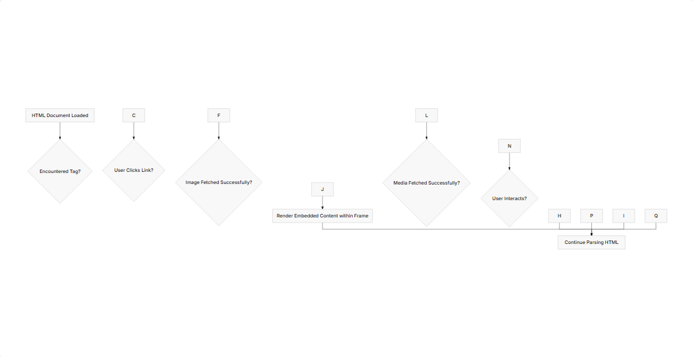

# Creating Links, Images, and Multimedia Elements
> You've already learned how to structure basic HTML documents, work with text, and create headings and paragraphs. Now, it's time to make your web pages interactive and engaging by adding links, images, and other multimedia elements. These elements are fundamental to how users navigate and consume content on the web, connecting disparate pages and embedding rich media directly into your structure.

## Creating Hyperlinks with `<a>`
* The `<a>` (anchor) tag is the cornerstone of web navigation. It allows you to create hyperlinks that, when clicked, take the user to another web page, a different section of the same page, or even trigger other actions like sending an email or initiating a phone call.

The most crucial attribute for the `<a>` tag is href (Hypertext REFerence). This attribute specifies the destination URL of the link.

```html

<!-- Linking to an external website -->
<p>Visit <a href="https://www.google.com">Google</a> for search.</p>
<!-- Linking to another page within your own website (relative path) -->
<p>Check out our <a href="about.html">About Us</a> page.</p>
<!-- Linking to a specific section on the *same* page (anchor link) -->
<!-- First, you need an element with an 'id' to serve as the target -->
<h2 id="section-2">Section Two</h2>
<p>Go to <a href="#section-2">Section Two</a>.</p>
<!-- Email link -->
<p>Contact us at <a href="mailto:info@example.com">info@example.com</a>.</p>
<!-- Phone link (especially useful on mobile devices) -->
<p>Call us at <a href="tel:+15551234567">555-123-4567</a>.</p>

```
## The target Attribute
* By default, clicking a link will open the new page in the same browser window or tab. The target attribute allows you to change this behavior. The most common value for target is _blank, which opens the linked document in a new window or tab.

```html

<p>Open Google in a <a href="https://www.google.com" target="_blank">new tab</a>.</p>
```
> Using target="_blank" is common for external links, but remember to consider user experience. Opening too many new tabs can be annoying. If you use it, it's a good practice to also add rel="noopener noreferrer" for security reasons, preventing the new page from potentially manipulating the opening page.

## Accessibility and Link Text
> Always use descriptive and meaningful link text. Avoid generic phrases like "click here" or "read more." The link text should make sense even out of context, informing users (including those using screen readers) where the link will take them.

```html

<!-- Bad example -->
<p>For more information, <a href="products.html">click here</a>.</p>
<!-- Good example -->
<p>Learn more about our <a href="products.html">product offerings</a>.</p>
```
## Embedding Images with ``
> Images are crucial for visual appeal and conveying information. The `` tag is used to embed an image into an HTML page. It's a self-closing tag, meaning it doesn't have a separate closing tag like `<a>` or `<p>`.
The two most essential attributes for `` are src and alt.

## src (source):
 Specifies the path to the image file. This can be a relative path (e.g., images/logo.png) or an absolute URL `(e.g., https://example.com/images/hero.jpg).`

## alt (alternative text): 
Provides a text description of the image. This is vital for accessibility, as screen readers announce this text to visually impaired users. It's also displayed if the image fails to load and is used by search engines for SEO.

```html

<!-- Image from a relative path -->

<!-- Image from an absolute URL -->

```

## Sizing Images
You can control the size of an image using the width and height attributes. It's generally better to let CSS handle sizing for responsiveness, but for specific, fixed-size images, these attributes can be used.

```html


```
## Important: 
While width and height can be set directly in HTML, using CSS for sizing is almost always preferred for better separation of concerns and responsive design. If you set only one dimension (e.g., width), the browser will automatically scale the other dimension proportionally to maintain the image's aspect ratio. If you set both and they don't match the original aspect ratio, the image can appear distorted.

## Image Optimization
Large image files can significantly slow down your page load times, negatively impacting user experience and SEO. Always optimize your images by:

## Compressing them: 
Tools like TinyPNG or online image optimizers can reduce file size without significant loss of quality.

## Using appropriate formats: 
JPG for photographs, PNG for images with transparency or sharp edges, SVG for vector graphics (logos, icons).

## Serving appropriately sized images: 
Don't serve a 4000px wide image if it will only be displayed at 400px.
Embedding Multimedia with ``<video> and <audio>``

HTML5 introduced native support for embedding video and audio without needing third-party plugins like Flash. The ``<video>`` and ``<audio>`` tags provide controls, autoplay, looping, and other functionalities directly in the browser.

> ### The ``<video>`` Tag
The ``<video>`` tag allows you to embed video content.

```html

<video width="640" height="360" controls>
  <source src="videos/intro.mp4" type="video/mp4">
  <source src="videos/intro.webm" type="video/webm">
  Your browser does not support the video tag.
</video>
```
## --> Key attributes for ``<video>``:

>  **src:`` (Similar to ) ``   The path to the video file. However, it's often better to use ``<source>`` tags for different formats.**

> **controls: Displays the browser's default video controls (play/pause, volume, seek bar, fullscreen).** 

> **autoplay: Starts playing the video automatically when the page loads. (Browsers often block autoplay with sound, requiring a muted attribute as well for it to work.)** 

> **loop: Repeats the video once it finishes.** 

> **muted: Mutes the audio of the video by default.**

> **poster: Specifies an image to be displayed before the video starts playing.**

> ## The ``<source>`` Tag
The `<source>` tag is used inside `<video>` or `<audio>` to specify multiple media resources for the browser to choose from. This is crucial for cross-browser compatibility, as different browsers support different video/audio formats. The browser will pick the first `<source>` it supports.

```html

<video width="640" height="360" controls poster="images/video-thumbnail.jpg">
  <source src="videos/my-awesome-video.mp4" type="video/mp4">
  <source src="videos/my-awesome-video.webm" type="video/webm">
  <p>Your browser doesn't support HTML5 video. Here is a <a href="videos/my-awesome-video.mp4">link to the video</a> instead.</p>
</video>

```

>## The ``<audio>`` Tag
The `<audio>` tag works very similarly to `<video>`, but for audio files.

```html

<audio controls>
  <source src="audio/background-music.mp3" type="audio/mpeg">
  <source src="audio/background-music.ogg" type="audio/ogg">
  Your browser does not support the audio element.
</audio>
```
> ### Key attributes for `<audio>`:

> src: Path to the audio file (can also use <source> tags).

> controls: Displays the browser's default audio controls.

> autoplay: Starts playing the audio automatically. (Often blocked by browsers without user interaction.)

> loop: Repeats the audio.

> muted: Mutes the audio.

Accessibility for Multimedia
For videos, consider providing:

####  tracks: For subtitles, captions, or descriptions in different languages.

 #### Transcripts: A text version of the video's dialogue and important visual information, available as a separate link.
  For audio, consider providing a transcript.

## Embedding External Content with ``<iframe>``
The `<iframe>` (inline frame) tag allows you to embed another HTML document within the current HTML document. This is commonly used to embed content from other websites, such as YouTube videos, Google Maps, or social media feeds.

```html

<iframe src="https://www.youtube.com/embed/dQw4w9WgXcQ" 
        width="560" 
        height="315" 
        title="YouTube video player" 
        frameborder="0" 
        allow="accelerometer; autoplay; clipboard-write; encrypted-media; gyroscope; picture-in-picture" 
        allowfullscreen>
</iframe>
```

## Key attributes for `<iframe>`:

> src: The URL of the page or resource to embed.

> width and height: The dimensions of the iframe.

> title: Essential for accessibility, providing a descriptive name for the iframe's content.

> frameborder: (Deprecated in HTML5, use CSS border property instead) Specifies whether to display a border around the iframe.

> allowfullscreen: Allows the embedded content to be displayed in fullscreen mode (e.g., a YouTube video).

> sandbox: Provides enhanced security by restricting the capabilities of the embedded content. This is a very important attribute for iframes.

> **Security Warning: Embedding content from untrusted sources using `<iframe>` can pose security risks (e.g., cross-site scripting attacks). Always be cautious about what you embed and use the sandbox attribute to restrict permissions where appropriate.**

## The Flow of Media on a Web Page
Here's a simple flow of how a browser might handle fetching and displaying these media types, from an HTML perspective:


## Exercises
## Exercise 1: Building a Simple Navigation Page
> Create an index.html file that includes:

  * A heading (e.g., "Welcome to My Website").
 
  * A paragraph explaining the site.

> Three links:
 * One to an external website (e.g., https://www.wikipedia.org) that opens in a new tab.

* One to an about.html page (which you'll create next).

* One to a contact.html page (which you'll also create next).

> An image related to your site (you can use a placeholder image if you don't have one).

Then, create about.html and contact.html files. Each should have:

*  A heading (e.g., "About Us", "Contact Us").
* A paragraph with some relevant text.
*  A link back to index.html.

> Test your navigation between these pages.


## Exercise 2: Multimedia Showcase
> Create a multimedia.html page. On this page:

* Embed a YouTube video using an ``<iframe>``. Find any public video on YouTube and use their "Embed" option to get the correct ``<iframe>`` code.

* Embed a local image (create an images folder and place an image inside it). Make sure to include descriptive alt text.

* Embed a simple audio file (you can find royalty-free samples online or use a short recording of your own). Provide at least two ``<source>`` formats for compatibility (e.g., MP3 and OGG). Ensure controls are visible.

* Embed a local video file (again, royalty-free samples are good, or use a short recording). Provide at least two ``<source>`` formats and include controls and a poster image.

# Summary
> You've now mastered the core elements for building interconnected and media-rich web pages. Hyperlinks  `(<a>)` form the backbone of web navigation, connecting documents and resources. Images `()` bring visual content to life, while `<video>` and `<audio>` tags embed dynamic multimedia directly into your pages, enhancing engagement. Finally, `<iframe>` allows you to seamlessly integrate content from other web sources. Understanding the proper use, attributes, and accessibility considerations for each of these elements is crucial for creating robust, user-friendly, and performant web experiences. Next, we'll dive into how to create interactive forms and input elements for gathering user data.